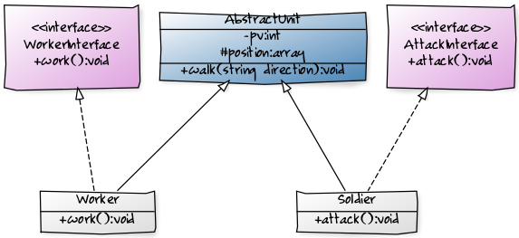

# Interfaces and Abstracts classes

## Objectifs :
 
 * Classe abstraite,
 * Interface,
 * Exception.

> Tu peux récupérer une partie de ton travail de l’atelier POO 2 et le modifier.

## Étapes

### Étape 1

Tu dois créer les classes et interfaces présentes sur le schéma ci-dessous.
Les flèches pointillées signifient “implémente” et sont donc liées à une interface.
Les flèches pleines (que tu as déjà vu) signifient “hérite”. Logiquement les classes abstraites sont en italiques, mais dans ce cas elle est préfixée par “Abstract”.

### Étape 2
Une fois que tu as tout créé, tu dois instancier une dizaine de “worker”. Lors de l’instanciation, ils devront dire “Oui monseigneur !” (voir le cours 1).  Tu dois instancier également une dizaine de “Soldier”, ces derniers devront dire “Prêt à combattre !” à l’instanciation (idem voir cours 1).

### Étape 3
Après tu peux les faire se déplacer avec la méthode walk().
Si lors d’un déplacement, ton personnage se trouve sur une coordonnée négative, lance une exception qui dit “hors de la carte !”.

### Étape 4
Les méthodes “work()” et “attack()” affichent respectivement “Je travaille !” et “À l’attaque !”. Fais donc travailler tes “Worker” et attaquer tes “Soldier”.

### Étape 5 (Bonus)

Peut être t’es tu dis que tu pourrais faire la même chose sans interface. Alors voici un exemple intéressant. La classe “Army” contient une méthode “join()”. Tente d’y insérer des “Worker” et des “Soldier”. Que constates tu ?
